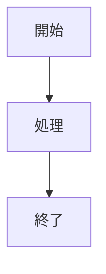
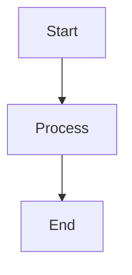

# Lite Markdown Editor

軽量でリアルタイムプレビュー機能を備えた Markdown エディタ

---

## 概要

Lite Markdown Editor は、Next.js 16 をベースにした軽量で高機能な Markdown エディタです。
リアルタイムプレビュー、数式レンダリング、ダイアグラム表示など、モダンな Markdown 編集体験を提供します。

## 主な機能

### ✅ コア機能 (v1.0)

-   **2 ペインレイアウト**: エディタとプレビューを左右に並べて表示
-   **リアルタイムプレビュー**: 入力と同時に Markdown をレンダリング（GFM 対応）
-   **スクロール同期**: エディタとプレビューの双方向スクロール連動
-   **ダークモード**: システム設定に応じた自動テーマ切り替え
-   **セキュリティ**: DOMPurify による XSS 対策

### ✅ 高機能プレビュー (v1.0)

-   **数式表示**: KaTeX による美しい数式レンダリング
    -   インライン数式: `` `$E = mc^2$` ``
    -   ブロック数式: `$$...$$`
-   **ダイアグラム**: Mermaid によるフローチャートやグラフの描画
-   **動的ロード**: 必要な機能のみを遅延読み込みして高速化

### 🚧 開発予定の機能

-   **UI カスタマイズ**: テーマとプレビュースタイルの切り替え
-   **エクスポート**: Markdown ファイルのダウンロード
-   **自動保存**: ローカルストレージへの一時保存

## 使い方

### インストールと起動

```bash
# リポジトリをクローン
git clone https://github.com/Aoi3u/lite-md-editor.git
cd lite-md-editor

# 依存関係をインストール
npm install

# 開発サーバーを起動
npm run dev
```

ブラウザで [http://localhost:3000](http://localhost:3000) を開いてエディタを使用できます。

### 使用例

**インライン数式**

アインシュタインの方程式: `$E = mc^2$`

**ブロック数式**

```markdown
$$
\frac{-b \pm \sqrt{b^2-4ac}}{2a}
$$
```

**Mermaid ダイアグラム**



## 技術スタック

-   **Next.js 16** (App Router)
-   **TypeScript**
-   **Tailwind CSS v4**
-   **CodeMirror 6** - エディタコンポーネント
-   **markdown-it** - Markdown パーサー（GFM 対応）
-   **KaTeX** - 数式レンダリング
-   **Mermaid** - ダイアグラム生成
-   **DOMPurify** - XSS 対策

## ライセンス

MIT License

---

---

# Lite Markdown Editor

A lightweight, real-time Markdown editor with advanced preview features.

---

## Overview

Lite Markdown Editor is a lightweight yet powerful Markdown editor built on Next.js 16.
It provides a modern Markdown editing experience with real-time preview, math rendering, and diagram support.

## Key Features

### ✅ Core Features (v1.0)

-   **2-Pane Layout**: Side-by-side editor and preview display
-   **Real-time Preview**: Instant Markdown rendering with GFM support
-   **Scroll Synchronization**: Bidirectional scroll sync between editor and preview
-   **Dark Mode**: Automatic theme switching based on system preferences
-   **Security**: XSS protection with DOMPurify

### ✅ Advanced Preview (v1.0)

-   **Math Rendering**: Beautiful math expressions with KaTeX
    -   Inline math: `` `$E = mc^2$` ``
    -   Block math: `$$...$$`
-   **Diagrams**: Flowcharts and graphs with Mermaid
-   **Dynamic Loading**: Lazy-loaded components for optimal performance

### 🚧 Upcoming Features

-   **UI Customization**: Theme and preview style switching
-   **Export**: Download Markdown files
-   **Auto-save**: Temporary save to local storage

## Usage

### Installation and Startup

```bash
# Clone the repository
git clone https://github.com/Aoi3u/lite-md-editor.git
cd lite-md-editor

# Install dependencies
npm install

# Run the development server
npm run dev
```

Open [http://localhost:3000](http://localhost:3000) in your browser to use the editor.

### Examples

**Inline Math**

Einstein's equation: `$E = mc^2$`

**Block Math**

```markdown
$$
\frac{-b \pm \sqrt{b^2-4ac}}{2a}
$$
```

**Mermaid Diagram**



## Tech Stack

-   **Next.js 16** (App Router)
-   **TypeScript**
-   **Tailwind CSS v4**
-   **CodeMirror 6** - Editor component
-   **markdown-it** - Markdown parser with GFM support
-   **KaTeX** - Math rendering
-   **Mermaid** - Diagram generation
-   **DOMPurify** - XSS protection

## License

MIT License
